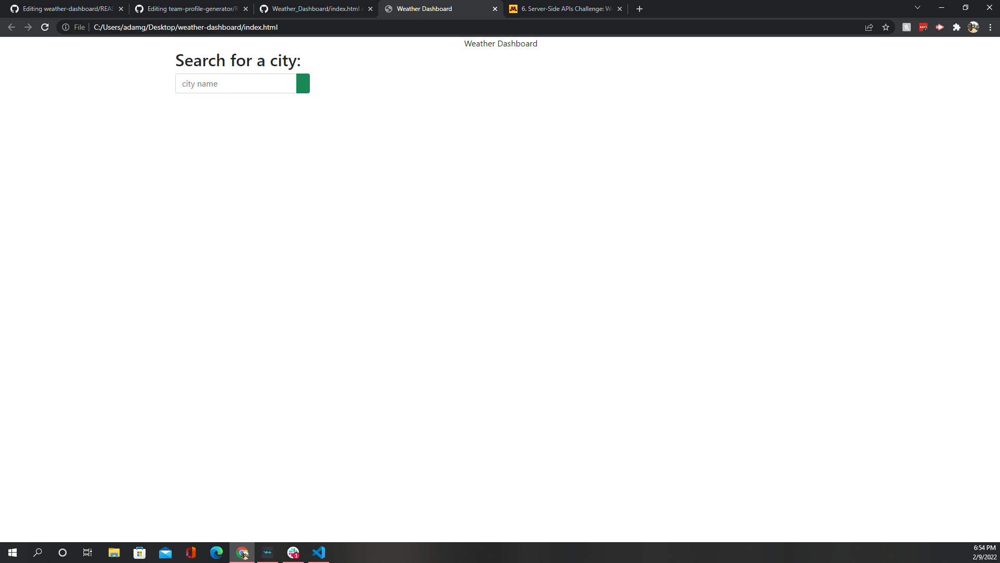

# Weather Dashboard

## Deployed Link To The dashboard

## What Is It 
it is a weather dashboard that will give you the current forecast and the 5 day forecast data and within thoes it gives the temp,humidity
, wind speed and UV index. iit also gives a weather icon to describe it 

## How Does It Work
when you put the city of your choice in the search bar it takes that and sends it to the open weather api and then the apii sends data back witch will populate the website.

## Some Of The Tech Used

html, css , javascript, jquery and the openweather api.

## On Startup 
When you first enter the website it will look like this

